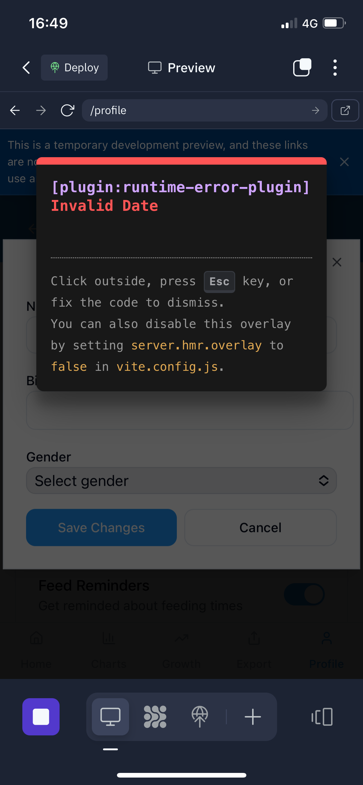

# TinyTracks

A comprehensive mobile-first application for tracking and monitoring baby development metrics. TinyTracks now includes pregnancy tracking from late stages through birth and into early childhood.



## Features

### Baby Tracking
- Activity tracking (feeds, nappies, sleep sessions)
- Growth charts and statistics
- Health record monitoring
- Quick entry for new data points
- Data comparison and export

### Pregnancy Tracking
- Contraction timing with intensity tracking
- Fetal movement (kick counter)
- Maternal health monitoring (weight, blood pressure, symptoms, mood)
- Gestational age calculator with countdown
- Preparation checklists (hospital bag, birth plan, nursery)
- Seamless transition from pregnancy to baby tracking

## Tech Stack

### Frontend
- React 18 with TypeScript
- TailwindCSS with shadcn/ui components
- React Query for data fetching and caching
- Wouter for routing
- Recharts for data visualization
- PWA support with offline capabilities

### Backend
- Express.js with TypeScript
- PostgreSQL database
- Drizzle ORM for database operations
- RESTful API architecture

### DevOps
- Jest and React Testing Library for unit/component testing
- GitHub Actions for CI/CD
- Vite for bundling with code-splitting
- Lighthouse audits for performance optimization
- Error tracking and analytics integration

## Getting Started

### Prerequisites
- Node.js 18+
- PostgreSQL database
- Git

### Installation

1. Clone the repository
```bash
git clone https://github.com/waynemkearns/tiny-tracks.git
cd tiny-tracks
```

2. Install dependencies
```bash
npm install
```

3. Set up environment variables
```bash
# Create a .env file with the following variables
DATABASE_URL=postgres://<username>:<password>@<host>:<port>/<database>
SESSION_SECRET=your_session_secret
```

4. Run database migrations
```bash
npm run db:push
```

5. Start development server
```bash
npm run dev
```

### Available Scripts

- `npm run dev` - Start the development server
- `npm run build` - Build the production-ready app
- `npm run start` - Start the production server
- `npm run test` - Run tests
- `npm run test:watch` - Run tests in watch mode
- `npm run test:coverage` - Generate test coverage report
- `npm run audit:lighthouse` - Run Lighthouse audits
- `npm run analyze` - Analyze bundle size

## Architecture

TinyTracks follows a component-based architecture with clear separation between data fetching, UI components, and business logic. See [ARCHITECTURE.md](docs/ARCHITECTURE.md) for more details.

## Contributing

Contributions are welcome! Please see [CONTRIBUTING.md](docs/CONTRIBUTING.md) for details.

## License

MIT License - see the [LICENSE](LICENSE) file for details.
